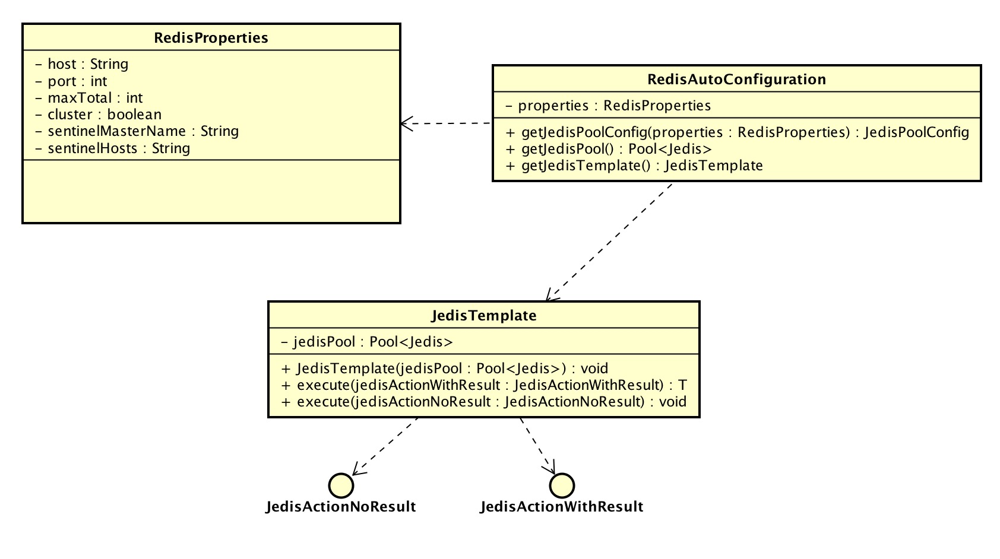
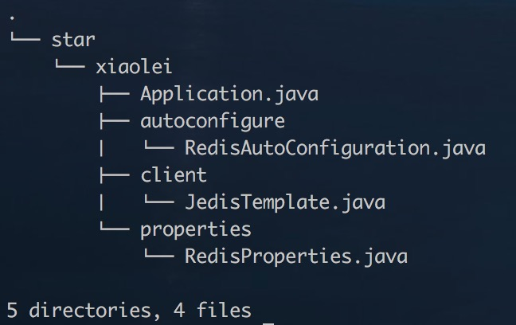
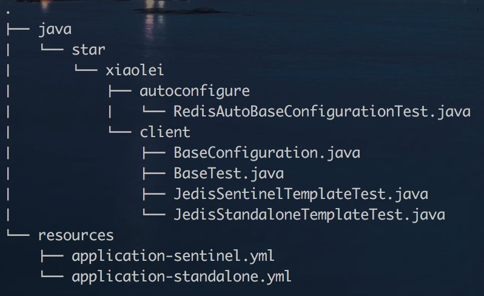

### spring-boot-starter-redis

#### 一. 关于spring-boot-starter-redis
##### 基于Spring-Boot, Jedis构建的Redis连接池工具,功能如下:
* 配置的装载: 通过读取yml文件,自动装配Bean;
* 连接池的获取: JedisTemplate负责连接池的管理,也可通过getJedisPool单独获取连接池;
* 连接池资源的释放: 每次执行完Redis的命令动作之后,自动释放连接池;
* 支持两种类型: 有返回结果的函数回调和无返回结果的函数回调;
* 支持Standalone和Sentinel模式，通过cluster属性作为开关；
* 使用JDK 8的Lambda表达式: 函数式编程, 接口编程.

#### 二. 项目结构
* UML



* 源码



```
RedisProperties.java: 装配属性配置信息;
RedisAutoConfiguration.java: 提供JedisPoolConfig, JedisPool, JedisTemplate的Bean实例化;
JedisTemplate.java: 通用的连接模板;
```
* 测试代码



```
RedisAutoBaseConfigurationTest.java: 测试配置的自动加载与Bean装配;
JedisTemplateTest.java: Standalone模式测试用例
JedisSentinelTemplateTest: Sentinel模式测试用例
```

#### 三. 配置(application.yml)
##### 使用Spring-Boot的yml文件进行配置的管理.
* Standalone模式

```
redis:
  host: 127.0.0.1
  port: 6379
  maxTotal: 5
  maxIdle: 0
  maxWaitMillis: 10000
  testOnBorrow: true
```

* Sentinel模式

```
redis:
  maxTotal: 5
  maxIdle: 0
  maxWaitMillis: 10000
  testOnBorrow: true
  cluster: true
  sentinel-master-name: test
  sentinel-hosts: 127.0.0.1:26378,127.0.0.1:26379
```

### 四. 如何使用
* 1 引入依赖

```
    <groupId>star.xiaolei</groupId>
    <artifactId>starter-redis</artifactId>
    <version>1.0-SNAPSHOT</version>
```

* 2 自动装配

```
    @Autowired
    private JedisTemplate jedisTemplate;
    
    @RequestMapping(value = "/get", method = RequestMethod.GET)
    public String get(String key) throws Exception {
        return jedisTemplate.execute(jedis -> {
            return jedis.get(key);
        });
    }
```

### 五. 待续
* 支持Cluster模式配置发现与装载.